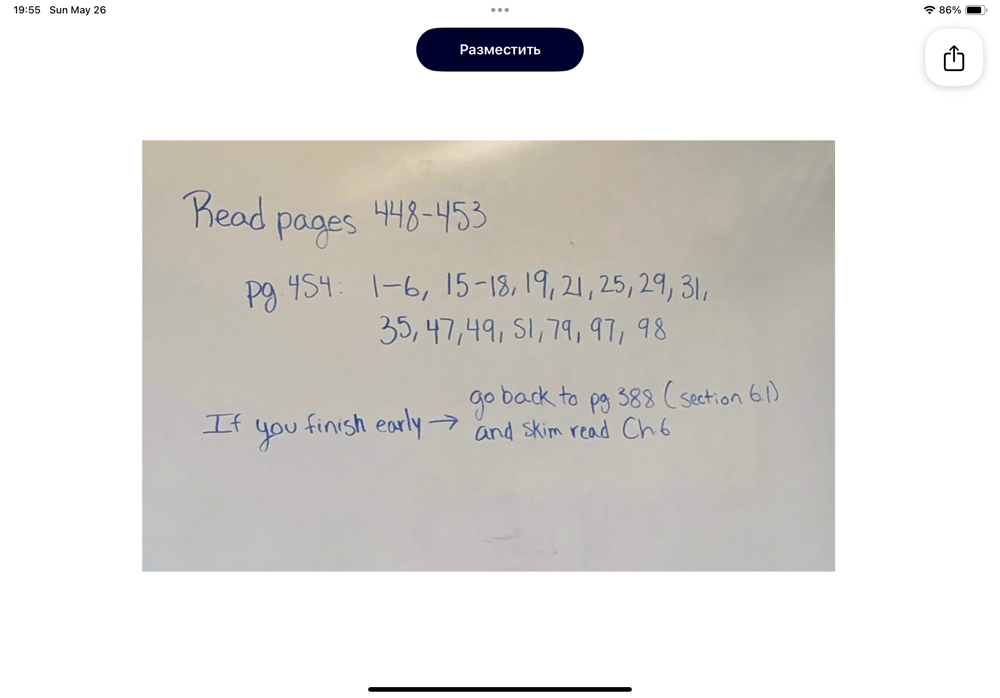
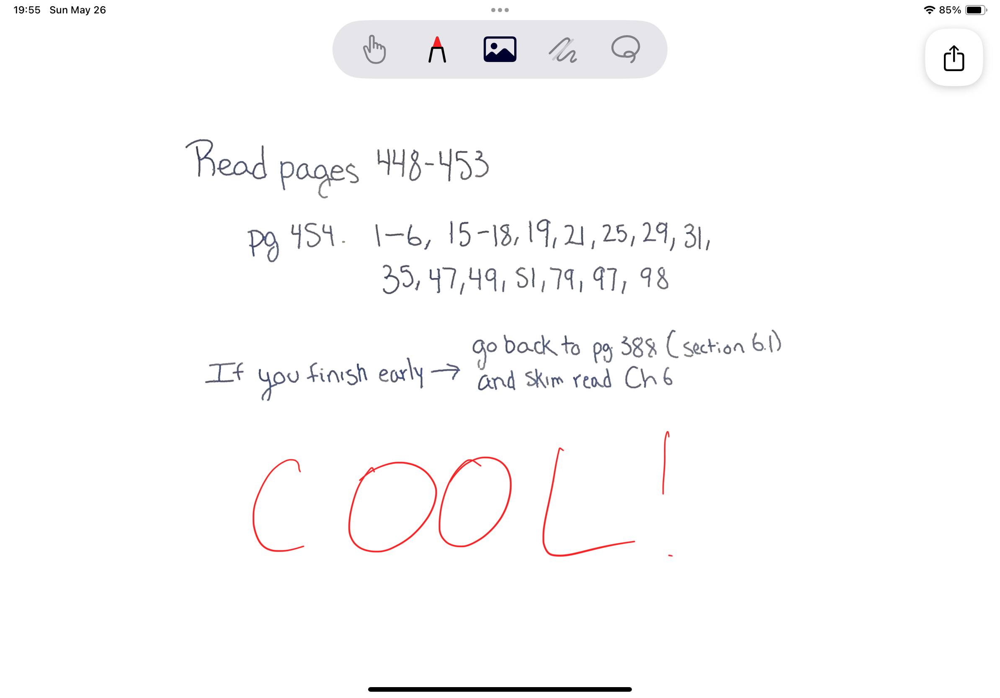
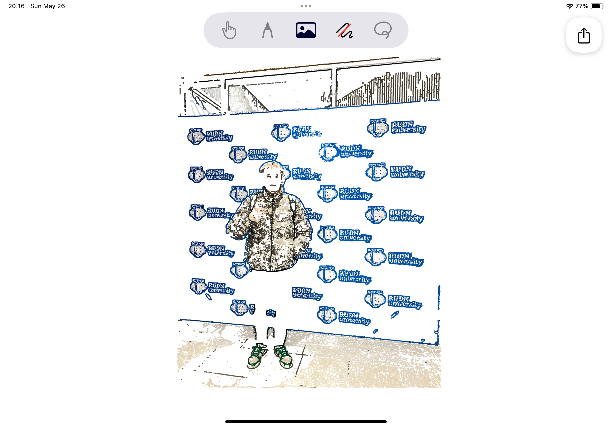

# Quillify

[TestFlight Link](https://testflight.apple.com/join/S5QVYEkX)

Это самое крутое приложение для iOS, которое объединяет миры бумаги и пикселей! С Quillify ваши рукописные заметки и рисунки оживут в цифровом формате, и с ними можно будет взаимодействовать, как с настоящими векторами😜

## Зачем🗣️?

- **Изображение в векторы:** Сфотографируйте свои рукописи или линейные рисунки, и наблюдайте, как Quillify волшебным образом превращает их в редактируемые векторные объекты!

- **Свободная интеграция:** Смешивайте и комбинируйте рукописные заметки, цифровой текст и фотки на одной виртуальной доске. Ваши учебные материалы станут организованными, как кухня в макдональдсе

Quillify делает мир заметок идеальным для студентов, профессионалов и всех, кто обожает писать вручную, но хочет возможностей цифровых технологий

## Фичи🫦

- **Scan**: Можете сделать фотографию и приложение сразу переведет её в векторную графику
- **Gallery**: Можете также выбрать нужное фото из галереи
- **Demo**: Для наглядность присутствует набор демо фоток, чтобы посмотреть как круто все работает
- **Telegram**: Выделите понравившиеся векторные обьекты на холсте и просто перетащите в диалог телеграма, и они отправятся как стикер!
- **Export**: Можете даже экспортировать все что вы нарисовали в pdf формате
- **Tools**: Из инструментов есть: касание, ручка (8 цветов!), ластик, и лассо для выделения
- И много других мелких деталей, которые вам обязательно понравятся

## Почему вам понравится🤠

- **Простота интерфейса:** Такой простой, красивый и интуитивно понятный, под силу любому инвалиду.
- **Мгновенное преобразование:** Векторизация рукописного текста в реальном времени для немедленного редактирования. жеесть!
- **Порядок:** Идеально для студентов, которые хотят навести порядок в своих учебных материалах и сделать учёбу немного less painful
- **Эффективность:** Быстро конвертируйте и редактируйте рукописные заметки, экономя время

## Используемые технологии🆒

- **SwiftUI**: Обеспечивает обновление интерфейса с изменениями в модели представления
- **UIKit**: Интеграция системных функций, таких как сканер документов VisionKit, селектор фотографий PhotosUI и холст PencilKit
- **Algorithm**: Алгоритм поиска путей описан в [статье](https://arxiv.org/pdf/1802.05902)
- **Combine**: Обеспечивает реактивное обновление элементов управления через подписку на изменения издателей
- **PencilKit**: Основной инструмент для отображения и создания векторных штрихов на холсте
- **Metal**: Используется для создания ядер изображений, выполняющихся на GPU, для преобразования фото в векторные изображения
- **Swift Concurrency**: Управление фоновыми задачами для обработки векторных изображений без блокировки основного потока
- **Core Graphics**: Обеспечивает рендеринг изображений, пока ожидаются преобразованные штрихи
- **Grand Central Dispatch**: Параллельное выполнение циклов для ускорения создания путей на нескольких потоках
- **PDFKit**: Для экспортирования холста в PDF
---
Короче всем советую, крутая штука
